<p align="center"></p>

<p align="center"><em>“What I cannot create, I do not understand.”</em><br><sub>RICHARD FEYNMAN, 1988</sub></p>

---

### `I` — Who

I'm a **Computer Engineering** student at **UW–Madison** who likes building things that solve real problems.

I've done machine learning research with the **U.S. Naval Research Laboratory** and built AI tools used by staff at **Rush University Medical Center**. I've also worked in IT risk at BDO and as a software engineer for the City of Chicago. Across all of it, I enjoy taking a messy problem, finding what's actually slowing things down, and building something that makes it better.

I'm interested in AI, machine learning, and technology that makes a real difference in people's work and lives.

### `II` — Path

```
2021  ●  Information Technology Developer — various roles
2022  ●  Software Engineer — City of Chicago
2023  ●  Researcher — Stanford University
2024  ●  Data Science Researcher — Argonne National Laboratory
2025  ●  Computer Engineering — University of Wisconsin–Madison
      ●  Software Engineer — Rush University Medical Center
      ●  Machine Learning Researcher — U.S. Naval Research Laboratory
      ●  Machine Learning Researcher — UW–Madison, Industrial & Systems Engineering
2026  ◉  Undergraduate Research Fellow — UW Health
```

### `III` — Instruments

<a href="https://www.python.org"></a>
<a href="https://dev.java"></a>
<a href="https://www.typescriptlang.org"></a>
<a href="https://developer.mozilla.org/en-US/docs/Web/JavaScript"></a>
<a href="https://en.wikipedia.org/wiki/SQL"></a>
<a href="https://pytorch.org"></a>
<a href="https://react.dev"></a>
<a href="https://nodejs.org"></a>
<a href="https://astro.build"></a>
<a href="https://git-scm.com"></a>
<a href="https://www.kernel.org"></a>

### `IV` — Correspondence

<a href="https://www.linkedin.com/in/bktruong"></a>
<a href="mailto:bktruong@wisc.edu"></a>

<p align="center"><sub>FIN. — OBSERVATION CONTINUES</sub></p>
